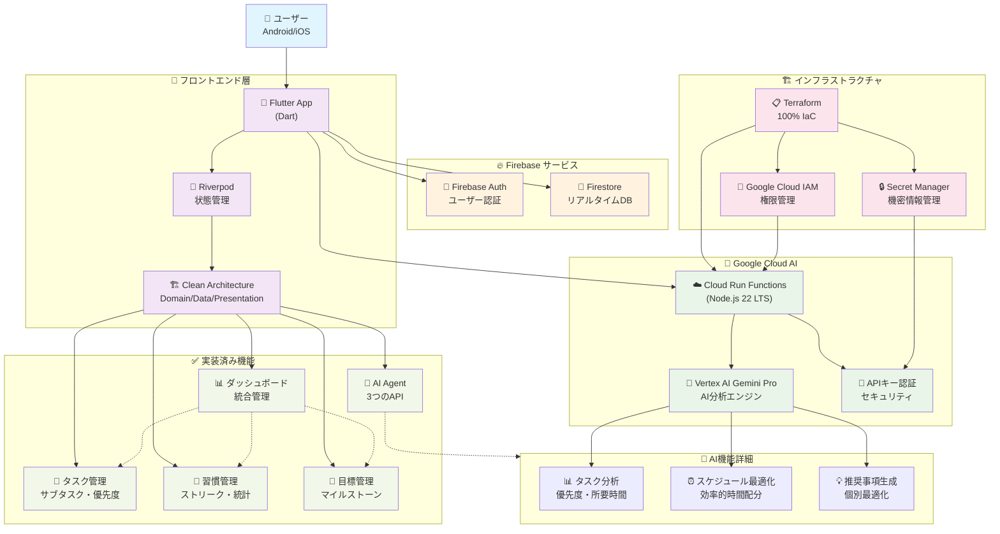

# システムアーキテクチャ図

```mermaid
graph TB
    %% ユーザー層
    User["👤 ユーザー<br/>Android/iOS"]
    
    %% フロントエンド層
    subgraph Frontend["🎨 フロントエンド層"]
        FlutterApp["📱 Flutter App<br/>(Dart)"]
        Riverpod["🔄 Riverpod<br/>状態管理"]
        CleanArch["🏗️ Clean Architecture<br/>Domain/Data/Presentation"]
    end
    
    %% 認証・データベース層
    subgraph Firebase["🔥 Firebase サービス"]
        FirebaseAuth["🔐 Firebase Auth<br/>ユーザー認証"]
        Firestore["💾 Firestore<br/>リアルタイムDB"]
    end
    
    %% バックエンド・AI層
    subgraph GoogleCloudAI["🤖 Google Cloud AI"]
        CloudRun["☁️ Cloud Run Functions<br/>(Node.js 22 LTS)"]
        VertexAI["🧠 Vertex AI Gemini Pro<br/>AI分析エンジン"]
        APIAuth["🔑 APIキー認証<br/>セキュリティ"]
    end
    
    %% インフラ・セキュリティ層
    subgraph Infrastructure["🏗️ インフラストラクチャ"]
        Terraform["📋 Terraform<br/>100% IaC"]
        IAM["👥 Google Cloud IAM<br/>権限管理"]
        SecretManager["🔒 Secret Manager<br/>機密情報管理"]
    end
    
    %% 実装済み機能
    subgraph Features["✅ 実装済み機能"]
        TaskMgmt["📝 タスク管理<br/>サブタスク・優先度"]
        HabitMgmt["🔄 習慣管理<br/>ストリーク・統計"]
        GoalMgmt["🎯 目標管理<br/>マイルストーン"]
        Dashboard["📊 ダッシュボード<br/>統合管理"]
        AIAgent["🤖 AI Agent<br/>3つのAPI"]
    end
    
    %% AI機能詳細
    subgraph AIFunctions["🧠 AI機能詳細"]
        TaskAnalysis["📊 タスク分析<br/>優先度・所要時間"]
        ScheduleOpt["⏰ スケジュール最適化<br/>効率的時間配分"]
        Recommendations["💡 推奨事項生成<br/>個別最適化"]
    end
    
    %% 接続関係
    User --> FlutterApp
    FlutterApp --> Riverpod
    Riverpod --> CleanArch
    
    FlutterApp --> FirebaseAuth
    FlutterApp --> Firestore
    FlutterApp --> CloudRun
    
    CloudRun --> VertexAI
    CloudRun --> APIAuth
    
    VertexAI --> TaskAnalysis
    VertexAI --> ScheduleOpt
    VertexAI --> Recommendations
    
    CleanArch --> TaskMgmt
    CleanArch --> HabitMgmt
    CleanArch --> GoalMgmt
    CleanArch --> Dashboard
    CleanArch --> AIAgent
    
    Terraform --> CloudRun
    Terraform --> IAM
    Terraform --> SecretManager
    IAM --> CloudRun
    SecretManager --> APIAuth
    
    %% データフロー
    Dashboard -.-> TaskMgmt
    Dashboard -.-> HabitMgmt
    Dashboard -.-> GoalMgmt
    AIAgent -.-> AIFunctions
    
    %% スタイリング
    classDef userClass fill:#e1f5fe
    classDef frontendClass fill:#f3e5f5
    classDef firebaseClass fill:#fff3e0
    classDef aiClass fill:#e8f5e8
    classDef infraClass fill:#fce4ec
    classDef featureClass fill:#f1f8e9
    
    class User userClass
    class FlutterApp,Riverpod,CleanArch frontendClass
    class FirebaseAuth,Firestore firebaseClass
    class CloudRun,VertexAI,APIAuth aiClass
    class Terraform,IAM,SecretManager infraClass
    class TaskMgmt,HabitMgmt,GoalMgmt,Dashboard,AIAgent featureClass
```